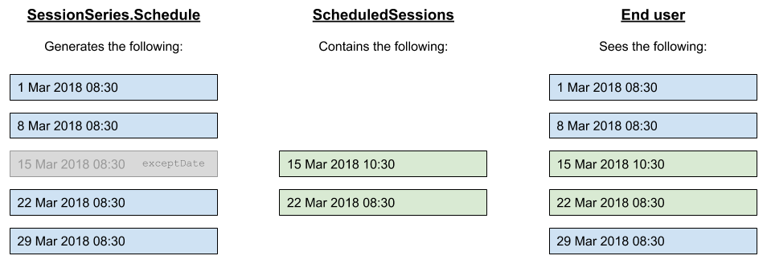

# Schedules

A [`Schedule`](../data-model/types/schedule.md) is a representation of a recurrence rule, compatible with the [iCalendar specification](https://tools.ietf.org/html/rfc5545), designed to be extrapolated by the data user into individual occurrences.

A [`PartialSchedule`](../data-model/types/partialschedule.md), by contrast, **must** **not** be extrapolated by the data user, and is for information only.

## Outputting a `Schedule` to a feed

A [`Schedule`](../data-model/types/schedule.md) **must** be included in the `SessionSeries` feed for systems that display occurrences of a sessions directly from a recurrence rule (as opposed to first materialising them into a database).

### Complementary `ScheduledSession`s

It is recommended that a `ScheduledSession` feed be published alongside any `SessionSeries` feed that contains `Schedule`s, and that this `ScheduledSession` feed also includes `remainingAttendeeCapacity`. If implementing the Open Booking API, such a complementary feed is **required**.

When `ScheduledSession`s are included in a feed or `subEvent`, they must not include all occurrences that are generated from the recurrence rule, and instead **must only** include those events that either:

1. Have bookings associated (i.e. where `remainingAttendeeCapacity` < `maximumAttendeeCapacity`)
2. Are an exception to the recurrence rule defined in the `Schedule`.
3. Have any other properties that differ from those defined in `SessionSeries`.

Such events would need to have been materialised in a database within the booking system already, so **under no circumstances should new occurrence records be generated for the sole purpose of outputting them to an OpenActive `ScheduledSession`s feed**.

This constraint is necessary to prevent recurrence rules from creating a high volume of redundant data in its `ScheduledSession` feed. For example: if a `SessionSeries` has a recurrence rule for a weekly event with an `endDate` in 2050, only the `ScheduledSession`s that have been booked at least once or have been manually edited would appear in the `ScheduledSession` feed.

### Using templates

When such `ScheduledSession`s are included, the `Schedule` **must** also include an `idTemplate`, such as the below, which matches the pattern of the `@id` of the `ScheduledSession`s (noting the `startDate` placeholder **must** use a string format of `YYYY-MM-DDThh:mm:ssZ` (e.g. `1997-07-16T19:20:00Z`):

```javascript
"idTemplate": "https://api.example.org/session-series/123/{startDate}"
```

A `urlTemplate` may also be included in the `Schedule` using the same `startDate` placeholder.

Note that if a single `ScheduledSession` that was previously generated by a `Schedule` is rescheduled to a different start time, its original `@id` **must** be retained (which contains the original start time), to ensure that it still hides the same generated occurrence (see below), and to ensure that [Change of Logistics Notifications](https://openactive.io/open-booking-api/EditorsDraft/#change-of-logistics-notifications) are still triggered.

Also note that if a `Schedule` is updated, it must include `exceptDates` for any overlaps with any  explicitly defined occurrences created from previous `Schedule`s, as they might have been rescheduled based on a previous `@id`.

## Processing a `Schedule` found in a feed

In order to process a [`Schedule`](../data-model/types/schedule.md) together with complimentary `ScheduledSession`s, the data user must do the following:

1. Generate all occurrences from a `Schedule` in the future, taking into account the `exceptDate` property.
   * Take the `scheduledEventType`, property and use it for the `@type` property of each occurrence.
   * Use an [RRULE](https://icalendar.org/iCalendar-RFC-5545/3-8-5-3-recurrence-rule.html) library to calculate the `startDate` of the occurrences based on the contents of the `Schedule`. `DTSTART` must be determined by using the `startDate`, `startTime`, and `scheduleTimezone` of the `Schedule` together, for example:
   *   ```
       {
         "@type": "Schedule",
         "startDate": "1997-09-02",
         "startTime": "09:00",
         "endTime": "10:00",
         "duration": "PT1H",
         "scheduleTimezone": "America/New_York",
         "repeatFrequency": "P1D",
         "repeatCount": 10
       }
       ```

       ```
       DTSTART;TZID=America/New_York:19970902T090000
       RRULE:FREQ=DAILY;COUNT=10
       ```
   * For the avoidance of doubt: the `startDate` and `startTime` of the `Schedule` are in "local time" based on the `scheduleTimezone`.
   * Use the `duration` of the `Schedule` to calculate the `endDate` of each occurrence.
   * Render the calculated `startDate` and `endDate` for each occurrence to UTC using a string format of `YYYY-MM-DDThh:mm:ssZ` (e.g. `1997-07-16T19:20:00Z`) for placeholder replacement.
   * Take the `idTemplate` property (if provided) and substitute the `startDate` placeholder with the calculated string value of `startDate` (and do the same with `endDate`). Use the resulting string as the value of the `@id` property for the occurrence.
   * Take the `urlTemplate` property (if provided) and substitute the `startDate` placeholder with the calculated string value of `startDate` (and do the same with `endDate`). Use the resulting string as the value of the `url` property for the occurrence.
2. To account for any changes in the `Schedule` since the last time it was updated, store the generated occurrences as follows:
   1. Upsert all generated occurrences, marking them with the `modified` RPDE timestamp associated with the `Schedule`. Ensure that any explicitly defined occurrences that may have been generated from a previous run of Step 3 (below) are not overwritten by this step.
   2. Delete all generated occurrences that do not have an older modified RPDE timestamp associated with the Schedule.
3. Ensure the generated occurrences are hidden by any matching explicitly defined occurrences (e.g.`ScheduledSession`s found in a `subEvent` or `ScheduledSession` feed), using the explicitly defined occurrence in its entirety based on its `@id`.

## Example

Extract from `SessionSeries` feed:

```javascript
{
  "@type": "SessionSeries",
  ...
  "eventSchedule": [
    {
      "@type": "Schedule",
      "repeatFrequency": "P1W",
      "startDate": "2018-03-01",
      "endDate": "2018-03-29",
      "startTime": "08:30",
      "endTime": "09:30",
      "byDay": [
        "https://schema.org/Thursday"
      ],
      "duration": "PT1H",
      "exceptDate": [
        "2018-03-15T08:30:00Z",
      ],
      "scheduleTimezone": "Europe/London",
      "scheduledEventType": "ScheduledSession",
      "idTemplate": "https://api.example.org/session-series/1402CBP20150217/{startDate}",
      "urlTemplate": "https://example.org/session-series/1402CBP20150217/{startDate}"
    }
  ]
}
```

Extract from `ScheduledSession` feed:

```javascript
{
  "state": "updated",
  "kind": "ScheduledSession",
  "id": "C5EE1E55-2DE6-44F7-A865-42F268A82C63",
  "modified": 1521565719,
  "data": {
    "@context": "https://openactive.io/",
    "@type": "ScheduledSession",
    "@id": "https://api.example.org/session-series/1402CBP20150217/2018-03-15T10:30:00Z",
    "identifier": "C5EE1E55-2DE6-44F7-A865-42F268A82C63",
    "superEvent": "https://example.com/api/session-series/1402CBP20150217",
    "startDate": "2018-03-15T10:30:00Z",
    "endDate": "2018-03-15T11:30:00Z",
    "duration": "PT1H",
    "eventStatus": "https://schema.org/EventScheduled",
    "maximumAttendeeCapacity": 10,
    "remainingAttendeeCapacity": 10,
    "url": "https://example.org/session-series/1402CBP20150217/2018-03-15T10:30:00Z"
  }
},
{
  "state": "updated",
  "kind": "ScheduledSession",
  "id": "C5EE1E55-2DE6-44F7-A865-42F268A82C64",
  "modified": 1521565719,
  "data": {
    "@context": "https://openactive.io/",
    "@type": "ScheduledSession",
    "@id": "https://api.example.org/session-series/1402CBP20150217/2018-03-22T08:30:00Z",
    "identifier": "C5EE1E55-2DE6-44F7-A865-42F268A82C64",
    "superEvent": "https://example.com/api/session-series/1402CBP20150217",
    "startDate": "2018-03-22T08:30:00Z",
    "endDate": "2018-03-22T09:30:00Z",
    "duration": "PT1H",
    "eventStatus": "https://schema.org/EventScheduled",
    "maximumAttendeeCapacity": 10,
    "remainingAttendeeCapacity": 3,
    "url": "https://example.org/session-series/1402CBP20150217/2018-03-22T08:30:00Z"
  }
}
```

Illustration of resulting opportunities presented to the end user:


